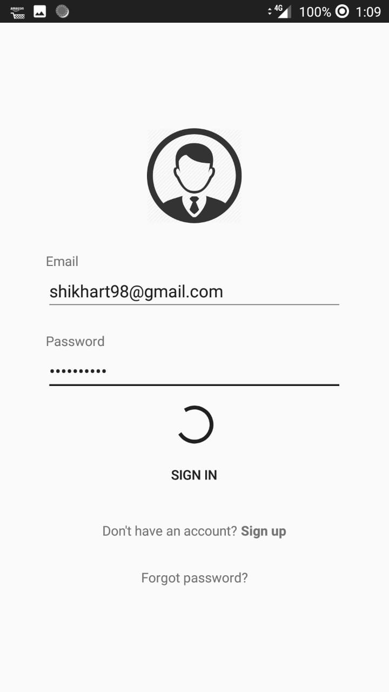
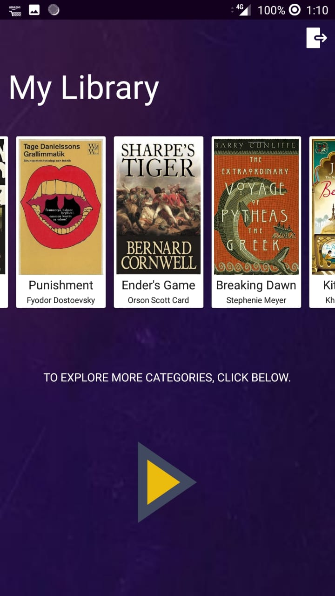

# E-commerce-Application-MockUp

It is a mock up E-commerce application. Includes perfect backend support using PHP, 000webhost. 

## Sign Up & Sign In screens

## Email - Verification (proper implementation using php and 000webhost)

## DashBoard Screen

## Categories Screen

